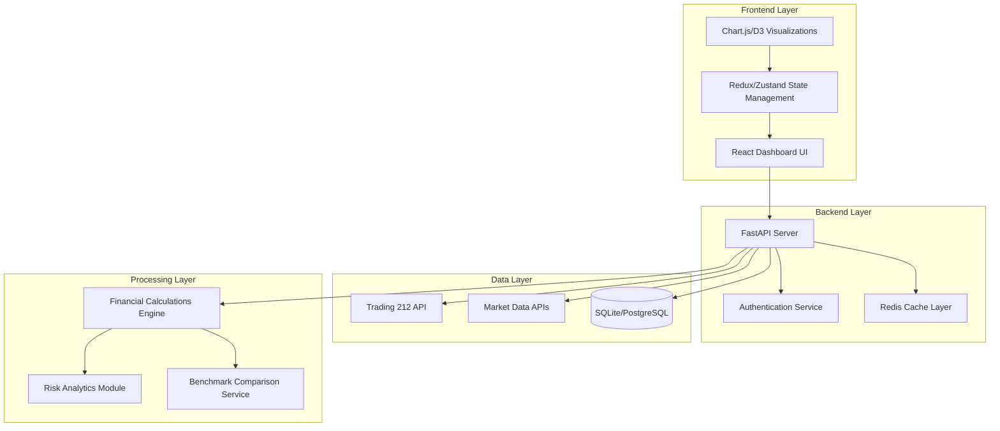
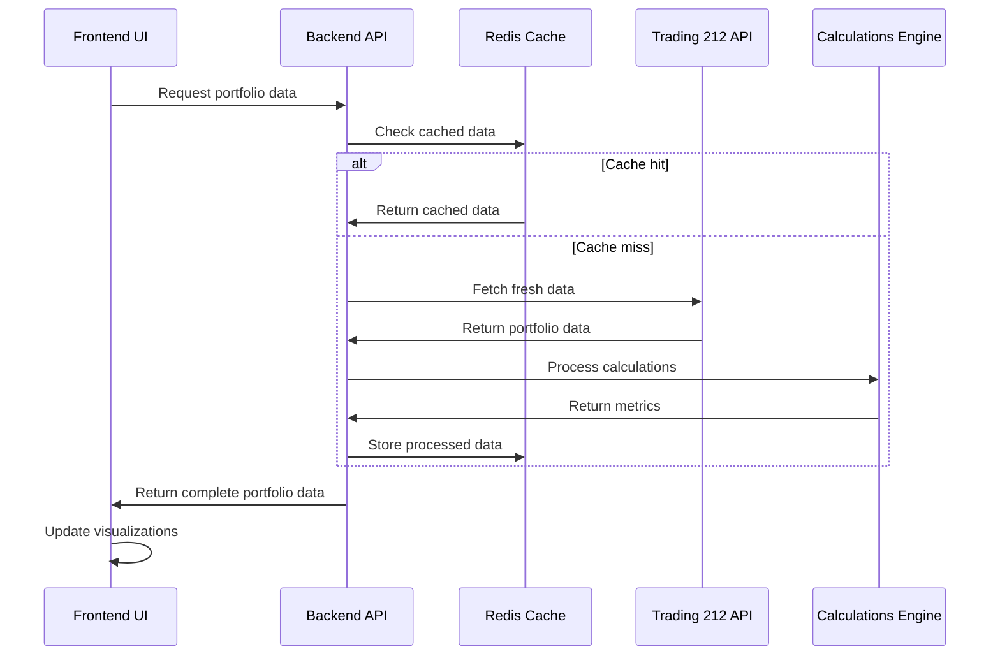

# Design Document

## Overview

The Trading 212 Portfolio Manager Dashboard is a modern web application built with React/TypeScript frontend and Python FastAPI backend. The system integrates with Trading 212's REST API to fetch real-time portfolio data and provides comprehensive analytics through interactive visualizations. The architecture follows a microservices pattern with clear separation between data fetching, processing, and presentation layers.

## Architecture

### High-Level Architecture



### Technology Stack

**Frontend:**
- React 18 with TypeScript for type safety
- Tailwind CSS for responsive styling with modern design system
- Framer Motion for smooth animations and micro-interactions
- Lucide React for consistent iconography
- Chart.js or Recharts for financial visualizations
- React Query for data fetching and caching
- React Router for navigation

**Backend:**
- Python with FastAPI framework
- Pydantic for data validation and type safety
- Redis for caching API responses
- SQLite for development, PostgreSQL for production
- JWT for session management

**External APIs:**
- Trading 212 API for portfolio data
- Alpha Vantage or Yahoo Finance for benchmark data
- Market data APIs for real-time pricing

## Modern UI Design System

### Design Principles
- **Smooth Animations**: All interactions use Framer Motion for fluid, spring-based animations
- **Backdrop Blur Effects**: Modern glassmorphism with backdrop-blur for depth and sophistication
- **Micro-interactions**: Subtle hover states, scale transforms, and transition effects
- **Gradient Accents**: Strategic use of gradients for visual hierarchy and modern appeal
- **Consistent Iconography**: Lucide React icons for clean, consistent visual language
- **Responsive Animations**: Animations that adapt to screen size and user preferences

### Animation Patterns
```typescript
type AnimationStyle = 
  | "from-bottom" | "from-center" | "from-top" 
  | "from-left" | "from-right" | "fade"
  | "top-in-bottom-out" | "left-in-right-out"

interface AnimationConfig {
  initial: MotionProps;
  animate: MotionProps;
  exit: MotionProps;
  transition: {
    type: "spring";
    damping: number;
    stiffness: number;
  };
}

// Standard animation variants for consistency
const standardAnimations = {
  cardHover: { scale: 1.02, y: -2 },
  buttonHover: { scale: 1.05 },
  iconHover: { scale: 1.1, rotate: 5 },
  backdropBlur: "backdrop-blur-md",
  shadowLevels: ["shadow-sm", "shadow-md", "shadow-lg", "shadow-xl"]
}
```

### Color System & Gradients
```typescript
interface ColorSystem {
  primary: {
    gradient: "from-primary/30 to-primary";
    background: "bg-primary/10";
    text: "text-primary";
    border: "border-primary/20";
  };
  
  neutral: {
    glass: "bg-neutral-900/50 dark:bg-neutral-100/50";
    backdrop: "bg-black/50";
    border: "border-neutral-200 dark:border-neutral-800";
  };
  
  interactive: {
    hover: "group-hover:brightness-[0.8]";
    focus: "focus:ring-2 focus:ring-primary/50";
    active: "active:scale-95";
  };
}
```

### Icon System with Lucide React
```typescript
// Financial Dashboard Icon Mapping
interface FinancialIcons {
  // Performance & Trends
  TrendingUp: LucideIcon;      // Positive performance
  TrendingDown: LucideIcon;    // Negative performance
  Activity: LucideIcon;        // Volatility/Activity
  BarChart: LucideIcon;        // Charts/Analytics
  PieChart: LucideIcon;        // Allocation views
  LineChart: LucideIcon;       // Time series
  
  // Financial
  DollarSign: LucideIcon;      // Currency/Value
  Percent: LucideIcon;         // Percentages
  Calculator: LucideIcon;      // Calculations
  Target: LucideIcon;          // Goals/Targets
  
  // UI Controls (matching snippet style)
  Play: LucideIcon;            // Play actions
  X: LucideIcon;               // Close (XIcon in snippet)
  Menu: LucideIcon;            // Navigation
  Settings: LucideIcon;        // Configuration
  Refresh: LucideIcon;         // Data refresh
  Eye: LucideIcon;             // Show/visibility
  EyeOff: LucideIcon;          // Hide
  
  // Status & Alerts
  CheckCircle: LucideIcon;     // Success states
  AlertTriangle: LucideIcon;   // Warnings
  Info: LucideIcon;            // Information
  AlertCircle: LucideIcon;     // Errors
}

interface IconWrapper {
  icon: LucideIcon;
  size?: "sm" | "md" | "lg" | "xl";
  variant?: "default" | "hover" | "active" | "disabled";
  animation?: "none" | "spin" | "pulse" | "bounce";
  className?: string;
}
```

## Components and Interfaces

### Frontend Components

#### Core Layout Components
```typescript
interface DashboardLayout {
  header: HeaderComponent;
  sidebar: NavigationSidebar;
  main: MainContent;
  footer?: FooterComponent;
}

interface HeaderComponent {
  logo: string;
  userProfile: UserProfile;
  apiStatus: ConnectionStatus;
  refreshButton: RefreshControl;
}
```

#### Portfolio Overview Components
```typescript
interface PortfolioOverview {
  totalValue: AnimatedMetricCard;
  totalReturn: AnimatedMetricCard;
  pieChart: InteractiveConsolidatedPieChart;
  pieList: AnimatedPieListComponent;
}

interface AnimatedMetricCard {
  title: string;
  value: number | string;
  change?: PercentageChange;
  trend?: TrendIndicator;
  animationDelay?: number;
  hoverEffect?: boolean;
  gradient?: boolean;
}

interface InteractiveElement {
  hoverScale?: number;
  clickAnimation?: AnimationStyle;
  backdropBlur?: boolean;
  shadowEffect?: boolean;
}
```

#### Pie Analysis Components
```typescript
interface PieAnalysisView {
  pieSelector: PieSelector;
  performanceMetrics: PiePerformanceCard;
  riskMetrics: PieRiskCard;
  allocationChart: PieAllocationChart;
  holdingsTable: TopHoldingsTable;
}
```

#### Financial Visualization Components
```typescript
interface ChartComponents {
  performanceChart: AnimatedTimeSeriesChart;
  allocationPieChart: InteractivePieChart;
  sectorBreakdownChart: AnimatedDonutChart;
  benchmarkComparisonChart: InteractiveLineChart;
  riskReturnScatterPlot: AnimatedScatterChart;
}

interface AnimatedChart extends InteractiveElement {
  enterAnimation: AnimationStyle;
  dataUpdateAnimation: AnimationStyle;
  tooltipAnimation: AnimationStyle;
  loadingState: SkeletonLoader;
}

interface ModernUIElements {
  backdropBlur: boolean;
  gradientBackgrounds: boolean;
  shadowEffects: boolean;
  hoverTransitions: boolean;
  microInteractions: boolean;
}
```

### Backend API Interfaces

#### Trading 212 Integration Service
```python
from pydantic import BaseModel
from typing import List, Optional
from datetime import datetime

class Trading212Service:
    async def authenticate(self, api_key: str) -> AuthResult:
        pass
    
    async def get_account_info(self) -> AccountInfo:
        pass
    
    async def get_pies(self) -> List[Pie]:
        pass
    
    async def get_positions(self) -> List[Position]:
        pass
    
    async def get_historical_data(self, symbol: str, period: str) -> HistoricalData:
        pass
    
    async def get_dividends(self) -> List[Dividend]:
        pass

class Pie(BaseModel):
    id: str
    name: str
    total_value: float
    invested_amount: float
    return_pct: float
    positions: List[Position]
    created_at: datetime
    updated_at: datetime
```

#### Financial Calculations Service
```python
import pandas as pd
import numpy as np
from typing import List

class CalculationsService:
    def calculate_portfolio_metrics(self, positions: List[Position]) -> PortfolioMetrics:
        pass
    
    def calculate_pie_metrics(self, pie: Pie) -> PieMetrics:
        pass
    
    def calculate_risk_metrics(self, returns: pd.Series) -> RiskMetrics:
        pass
    
    def calculate_benchmark_comparison(self, portfolio_returns: pd.Series, benchmark_returns: pd.Series) -> BenchmarkComparison:
        pass

class PortfolioMetrics(BaseModel):
    total_value: float
    total_invested: float
    total_return: float
    annualized_return: float
    volatility: float
    sharpe_ratio: float
    max_drawdown: float
    beta: float
```

### Data Models

#### Core Data Models
```python
from enum import Enum
from typing import List, Optional

class AssetType(str, Enum):
    STOCK = "STOCK"
    ETF = "ETF"
    CRYPTO = "CRYPTO"

class RiskCategory(str, Enum):
    LOW = "LOW"
    MEDIUM = "MEDIUM"
    HIGH = "HIGH"

class Portfolio(BaseModel):
    id: str
    user_id: str
    total_value: float
    total_invested: float
    pies: List[Pie]
    positions: List[Position]
    metrics: PortfolioMetrics
    last_updated: datetime

class Position(BaseModel):
    symbol: str
    name: str
    quantity: float
    average_price: float
    current_price: float
    market_value: float
    unrealized_pnl: float
    sector: str
    industry: str
    country: str
    asset_type: AssetType

class RiskMetrics(BaseModel):
    volatility: float
    beta: float
    sharpe_ratio: float
    max_drawdown: float
    var_95: float  # Value at Risk
    risk_category: RiskCategory
```

## Error Handling

### API Error Handling Strategy
```python
from fastapi import HTTPException
from enum import Enum

class ErrorType(str, Enum):
    AUTHENTICATION_FAILURE = "authentication_failure"
    RATE_LIMIT_EXCEEDED = "rate_limit_exceeded"
    API_UNAVAILABLE = "api_unavailable"
    INVALID_REQUEST = "invalid_request"
    INSUFFICIENT_DATA = "insufficient_data"
    CALCULATION_ERROR = "calculation_error"

class APIError(HTTPException):
    def __init__(self, error_type: ErrorType, detail: str, status_code: int = 400):
        super().__init__(status_code=status_code, detail=detail)
        self.error_type = error_type

# Error handlers for different scenarios
async def handle_trading212_errors(error_type: ErrorType, detail: str):
    if error_type == ErrorType.AUTHENTICATION_FAILURE:
        raise APIError(error_type, detail, 401)
    elif error_type == ErrorType.RATE_LIMIT_EXCEEDED:
        raise APIError(error_type, detail, 429)
    # ... other error handling
```

### Error Recovery Mechanisms
- **Retry Logic:** Exponential backoff for API calls with circuit breaker pattern
- **Fallback Data:** Cache previous successful responses for offline viewing
- **Graceful Degradation:** Show partial data when some services are unavailable
- **User Feedback:** Clear error messages with suggested actions

## Testing Strategy

### Frontend Testing
```typescript
interface FrontendTesting {
  unitTests: {
    components: 'React Testing Library + Jest';
    utilities: 'Jest for calculation functions';
    hooks: 'React Hooks Testing Library';
  };
  
  integrationTests: {
    apiIntegration: 'MSW for API mocking';
    userFlows: 'Cypress for E2E testing';
    visualRegression: 'Percy or Chromatic';
  };
}
```

### Backend Testing
```python
# Testing framework configuration
backend_testing = {
    "unit_tests": {
        "services": "pytest for business logic",
        "calculations": "pytest with financial test cases using pandas/numpy",
        "utilities": "pytest for helper functions"
    },
    
    "integration_tests": {
        "api_endpoints": "pytest with FastAPI TestClient",
        "database_operations": "pytest with test database fixtures",
        "external_apis": "httpx_mock for API mocking"
    }
}

# Example test structure
import pytest
from fastapi.testclient import TestClient
from unittest.mock import Mock

@pytest.fixture
def test_client():
    return TestClient(app)

def test_portfolio_metrics_calculation():
    # Test financial calculations with known data
    pass
```

### Performance Testing
- **Load Testing:** Locust for Python-based API endpoint performance testing
- **Frontend Performance:** Lighthouse CI for Core Web Vitals
- **Memory Profiling:** Python memory_profiler and cProfile for performance analysis
- **Database Performance:** SQLAlchemy query analysis and indexing optimization
- **Financial Calculations:** Benchmark pandas/numpy operations for large datasets

## Security Considerations

### API Security
```typescript
interface SecurityMeasures {
  authentication: {
    jwtTokens: 'Short-lived access tokens';
    refreshTokens: 'Secure refresh mechanism';
    apiKeyEncryption: 'AES-256 encryption for Trading 212 keys';
  };
  
  dataProtection: {
    encryption: 'Encrypt sensitive data at rest';
    transmission: 'HTTPS/TLS for all communications';
    sanitization: 'Input validation and sanitization';
  };
  
  accessControl: {
    rateLimiting: 'Prevent API abuse';
    cors: 'Restrict cross-origin requests';
    headers: 'Security headers (CSP, HSTS, etc.)';
  };
}
```

### Data Privacy
- **Local Storage:** Minimize sensitive data in browser storage
- **API Keys:** Never expose Trading 212 API keys in frontend code
- **Audit Logging:** Track access to sensitive financial data
- **Data Retention:** Implement data cleanup policies

## Performance Optimization

### Frontend Optimization
```typescript
interface PerformanceOptimization {
  rendering: {
    lazyLoading: 'React.lazy for route-based code splitting';
    memoization: 'React.memo for expensive components';
    virtualization: 'React Window for large lists';
    animationOptimization: 'Framer Motion layout animations with will-change';
  };
  
  dataFetching: {
    caching: 'React Query with stale-while-revalidate';
    prefetching: 'Prefetch critical data on route change';
    pagination: 'Paginate large datasets';
    optimisticUpdates: 'Immediate UI feedback with rollback';
  };
  
  bundleOptimization: {
    treeshaking: 'Remove unused code';
    compression: 'Gzip/Brotli compression';
    cdn: 'CDN for static assets';
    motionOptimization: 'Tree-shake unused Framer Motion features';
  };
  
  userExperience: {
    skeletonLoaders: 'Animated loading states for all components';
    errorBoundaries: 'Graceful error handling with recovery options';
    accessibilityAnimations: 'Respect prefers-reduced-motion';
    responsiveAnimations: 'Adaptive animations for different screen sizes';
  };
}
```

### Backend Optimization
- **Caching Strategy:** Redis for frequently accessed calculations
- **Database Indexing:** Optimize queries for portfolio and position lookups
- **API Response Compression:** Gzip compression for large JSON responses
- **Connection Pooling:** Efficient database connection management

## Deployment Architecture

### Development Environment
```yaml
services:
  frontend:
    build: ./frontend
    ports: ["3000:3000"]
    environment:
      - REACT_APP_API_URL=http://localhost:8000
  
  backend:
    build: ./backend
    ports: ["8000:8000"]
    environment:
      - ENVIRONMENT=development
      - DATABASE_URL=sqlite:///./dev.db
      - REDIS_URL=redis://redis:6379
    depends_on:
      - redis
  
  redis:
    image: redis:alpine
    ports: ["6379:6379"]
```

### Production Deployment
- **Frontend:** Static hosting on Vercel/Netlify with CDN
- **Backend:** Python FastAPI app on Railway/Render with Gunicorn/Uvicorn
- **Database:** Managed PostgreSQL instance
- **Caching:** Redis Cloud or managed Redis service
- **Monitoring:** Application performance monitoring with Sentry
- **Python Dependencies:** Poetry or pip-tools for dependency management

## Data Flow Architecture

### Real-time Data Updates


### Batch Processing for Historical Analysis
- **Daily Jobs:** Update historical performance data
- **Weekly Jobs:** Recalculate risk metrics and benchmarks
- **Monthly Jobs:** Generate portfolio reports and analytics
- **Real-time Updates:** Live price updates during market hours